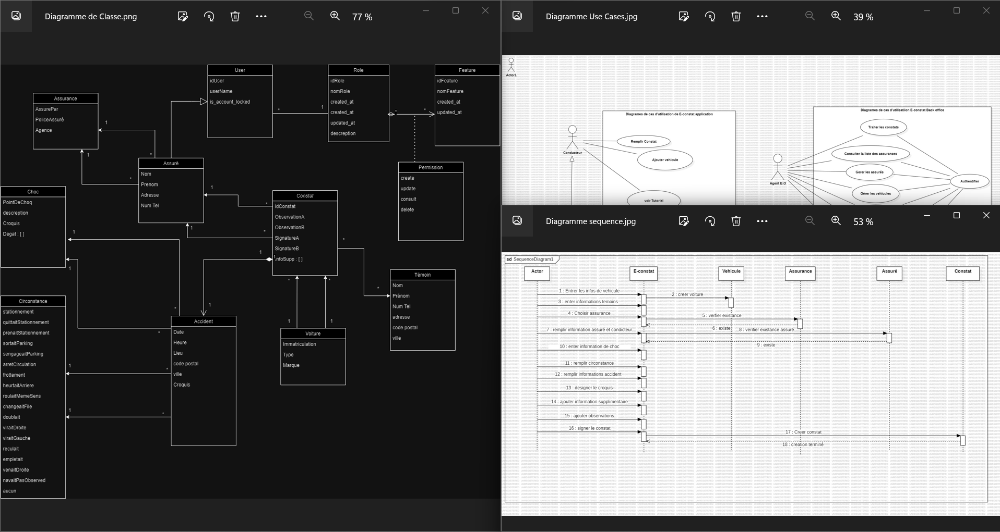

# 📱 E-Constat Mobile App

**Digital Insurance Claim Management System**

A modern React Native mobile application for streamlined insurance claim reporting and management.

[](https://reactnative.dev/)
[](https://nodejs.org/)
[](https://www.mongodb.com/)

## 🌟 Features

- 📝 **Digital Claim Reporting** - Create and manage insurance claims
- 📷 **Photo Documentation** - Capture and attach incident photos
- ✍️ **Digital Signatures** - Collect signatures from all parties
- 🚗 **Vehicle Management** - Track multiple vehicles and insurance details
- 📊 **Report Generation** - Generate comprehensive PDF reports

## 🛠️ Tech Stack

**Frontend:** React Native, JavaScript, React Navigation  
**Backend:** Node.js, Express.js, MongoDB, Mongoose  
**Authentication:** JWT, Bcrypt

## 📱 App Screenshots

<div align="center">
  
  
  
  
</div>

<div align="center">
  
  
  
  
</div>

<div align="center">
  
  
  
  
</div>

<div align="center">
  
  
  
  
</div>

## 🏗️ App Architecture

<div align="center">
  
</div>

## 🚀 Quick Start

### Prerequisites

- Node.js 18+
- React Native CLI
- MongoDB

### Installation

```bash
# Clone the repository
git clone https://github.com/Haythem532002/Constat.git
cd Constat

# Install Frontend dependencies
cd Frontend
npm install

# Install Backend dependencies
cd ../Backend
npm install

# Start the backend server
npm start

# In a new terminal, start the React Native app
cd ../Frontend
npm start
```

## 📁 Project Structure

```
Constat/
├── Frontend/           # React Native mobile app
│   ├── Components/     # Reusable UI components
│   ├── Screens/        # App screens
│   └── assets/         # Images and static files
├── Backend/            # Node.js API server
│   ├── models/         # Database models
│   ├── routes/         # API routes
│   ├── controllers/    # Business logic
│   └── utils/          # Utility functions
└── e-constat/          # App screenshots
```

## 🤝 Contributing

1. Fork the repository
2. Create your feature branch (`git checkout -b feature/AmazingFeature`)
3. Commit your changes (`git commit -m 'Add AmazingFeature'`)
4. Push to the branch (`git push origin feature/AmazingFeature`)
5. Open a Pull Request

## 📄 License

This project is licensed under the MIT License.

---

**Built with ❤️ using React Native & Node.js**
